# Project Documentation
## System & Network Diagnostics Toolkit

**Status:** Active — repo scaffolding + fully-built "simple/hard" pieces complete; Phase "Early POC" (C++ core: `#SYS-1`, `#MEM-1`) is the current open work
**Author:** Vishu
**Context:** Personal learning project ahead of a CS Master's application
**Primary purpose:** Real, hands-on C++ (memory management) and networking experience — not a resume-padding exercise
**Last updated:** 2026-08-25 (v2 — see Section 0)

---

## 0. Document History

- **v1 (original draft):** Initial planning doc — scope, BOM, timeline, architecture, module breakdown. All still in force below except where explicitly superseded by v2.
- **v2 (this revision, 2026-08-25):** The repo now exists on disk with the structure in Section 15. This revision:
  - Records the split between what got built for you and what's left as a `#TODO` for you to implement — see the new **Section 16**.
  - Replaces Section 12's original 8-phase draft table with the actual 12-week calendar being followed — a plain 6-bucket arc (Practice / Early POC / Keep working / Beta / Improve with feedback / Finish) — reconciling the two rather than running both in parallel.
  - Resolves **Open Decision #4** (Section 14): **C++20**, not C++17 — decided during a live conversation, on the grounds that C++17 (2017) is simply too old a baseline for a project starting in 2026. A C++23 upgrade is explicitly scheduled as a post-beta evaluation (weeks 9-10), not left open indefinitely.
  - Resolves the tension in **Open Decision #2**: the doc locks in Linux-first, but the actual dev machine is Windows 11. Resolved via **WSL2** rather than reopening cross-platform scope or rewriting the C++ module against Win32 APIs — see Section 9 (BOM) and Section 12.
  - Adds `SandboxBugReport` and the `--memory-demo` CLI flag design (Section 5.1/5.4) — not in the original draft, needed once the memory-sandbox module got scaffolded far enough to notice that two of its four required demos are undefined behavior and can't safely run on every default diagnostic pass.
  - This file and `docs/project-charter.md` are kept identical — the latter is what `README.md` links to; edit either and copy over the other.

Companion living documents (not duplicated here — go read them directly):
- `docs/working-plan.md` — the 12-week schedule in calendar form
- `docs/TODO.md` — the checkable, per-file task list with IDs (`#SYS-1`, `#MEM-1`, `#NET-1`, etc.) referenced throughout this document

---

## 1. Project Overview

A modular diagnostics application that:
- Reads local hardware/memory/process metrics via a **C++ engine** (this is where the actual learning target lives — manual memory handling, RAII, OS-level APIs)
- Runs basic **network diagnostics** (latency, DNS, port checks) via **Python**
- Sends the combined telemetry to the **Gemini API** to generate a plain-language summary and recommendations
- Ships as a **CLI tool first**, with a desktop GUI as a later, optional phase (see §14)
This isn't a novel product — `htop`, `nmap`, and a dozen SaaS tools already do pieces of this better. That's fine. The point isn't the tool; it's that building it forces you through raw pointers, RAII, subprocess/IPC boundaries, and basic sockets, which is exactly the gap between "SQL + light Python" and "CS Master's applicant."

---

## 2. Learning Objectives

### Primary (the actual point of the project)
- Get comfortable with **C++ memory management**: raw pointers → deliberate bugs (leak, dangling pointer, double free) → diagnosing them with Valgrind/ASan → refactoring to RAII (`std::unique_ptr`/`std::shared_ptr`)
- Practice **OS-level system interaction** (reading `/proc`, or the equivalent Win32 calls if you go cross-platform)
- Reinforce **networking fundamentals** from your minor coursework (sockets, DNS resolution, latency measurement) by implementing them, not just describing them
### Secondary
- Multi-language IPC (C++ subprocess called from Python, or vice versa) and structured data exchange (JSON)
- Talking to a real external API (Gemini) with rate limits, error handling, and structured prompting
- Practicing incremental, modular software design and writing documentation you'd actually hand to a hiring manager or admissions committee
---

## 3. Scope

### In scope (v1)
- CLI-based diagnostic tool
- System diagnostics: CPU load, memory (total/available/per-process), basic disk usage
- Memory module: a deliberately-instrumented allocation sandbox (raw pointers first, refactored to smart pointers) — this is a **teaching module**, not just a feature
- Network diagnostics: ping/latency, DNS lookup, basic port scan (unprivileged ports)
- JSON aggregation layer combining C++ and Python output
- Gemini API integration for summary + recommendations
- Linux as the primary/first target (built and run inside **WSL2** on this Windows dev machine — see §14 Open Decision #2)
### Explicitly out of scope (v1)
- Full cross-platform support (Windows/macOS become stretch goals, not requirements)
- Desktop GUI (deferred — see §14)
- Raw packet capture / anything requiring elevated privileges
- Kernel-level anything
- Production-grade security hardening
- Distributed/multi-host monitoring
---

## 4. System Architecture

```mermaid
flowchart LR
    subgraph CPP["C++ Engine (libsysdiag)"]
        A[System calls / /proc reads] --> B[Memory sandbox<br/>raw ptr → RAII]
        B --> C[JSON telemetry writer]
    end

    subgraph PY["Python Orchestrator (netdiag.py)"]
        D[subprocess.Popen → runs C++ engine] --> E[Network probes<br/>ping / DNS / port scan]
        E --> F[Merge C++ + Python telemetry]
    end

    subgraph AI["Gemini Analyzer (ai_analyzer.py)"]
        G[Prompt builder] --> H[Gemini API call]
        H --> I[Structured recommendation output]
    end

    C --> D
    F --> G
    I --> J[CLI report output]
```



### Module breakdown (as built — see Section 15 for the full tree)
| Module | Language | Responsibility | Status |
|---|---|---|---|
| `libsysdiag` (`cpp/`) | C++20 | Hardware/memory/process telemetry, memory-handling sandbox | Scaffolded — `#SYS-1`, `#MEM-1` open |
| `netdiag` (`python/netdiag/`) | Python 3.10+ | Runs the C++ binary as a subprocess, performs network probes, merges JSON | `config.py`/`schema.py`/`report_writer.py` **built**; probes + `engine_runner.py` — `#NET-1` through `#NET-4` open |
| `ai_analyzer` (`python/ai_analyzer/`) | Python 3.10+ | Builds the prompt from merged telemetry, calls Gemini, parses the structured response | Client setup **built**; prompt/call/parse logic — `#AI-1` through `#AI-3` open |
| `cli` (`python/cli/`) | Python | Entry point, argument parsing, report formatting | **Built** |

---

## 5. Functional Requirements

### 5.1 C++ System & Memory Module
- Retrieve total/available RAM and per-process memory usage (`/proc/meminfo`, `/proc/[pid]/status` on Linux)
- Retrieve CPU model, core count, and current load
- Retrieve basic disk usage
- Implement a **memory sandbox class**: allocate/deallocate via raw pointers first (intentionally, to observe failure modes), then refactor the same functionality to `std::unique_ptr`/`std::shared_ptr`
  - **(v2 addition)** Built out as four explicit demos — clean cycle, leak, dangling pointer, double free — each returning a `SandboxBugReport`. Two of the four are undefined behavior by design, which surfaced a requirement the v1 draft didn't anticipate: these can't run on the default diagnostic pass (see the `--memory-demo` flag in §5.4).
- Emit structured JSON to `stdout` (keep payload under typical pipe buffer limits, or stream-parse if it grows)
### 5.2 Python Network Module
- ICMP ping (avg/min/max latency) — via shelling out to the system `ping` binary, not a raw socket (see §14 Open Decision #3's reasoning, which generalizes to this too)
- DNS resolution timing
- Basic TCP port scan over a configurable, user-supplied range (no raw sockets / no elevated privileges required)
- Emit structured JSON matching the C++ module's schema conventions
### 5.3 Gemini Integration Module
- Accept the merged JSON payload
- Build a structured prompt (define the schema you want back — don't let the model free-form it)
- Parse the response into: summary, likely cause(s), suggested fix(es), rough severity
- Handle rate limits and API errors gracefully (this will happen on the free tier — see §9)
### 5.4 CLI
- Run full diagnostic pass
- Print raw telemetry (optional `--raw` flag)
- Print Gemini analysis
- Export a report to a text/JSON file (`--export json|text`)
- **(v2 addition)** `--memory-demo <name|all>` — opt-in flag to run one or all of the C++ memory-sandbox demos as part of a pass. Not part of the default run (see §5.1).
---

## 6. Non-Functional Requirements

| Category | Requirement |
|---|---|
| Performance | C++ module completes in well under 1s for a single snapshot; network module under ~5s depending on port range |
| Security | No raw packet payloads stored; no elevated privileges required; only the diagnostic JSON leaves the machine (to Gemini) |
| Portability | Linux (Ubuntu 22.04+, via WSL2 — see §14) as the primary target; document what would need to change for native Windows/macOS even if you don't build it |
| Maintainability | Clear module boundaries, each independently testable |
| Reliability | Graceful handling of missing sensors, permission errors, and API failures — don't let one bad reading crash the whole run |

---

## 7. Technology Stack

| Component | Choice | Notes |
|---|---|---|
| Core diagnostics language | **C++20** | **Resolved 2026-08-25 (§14 Open Decision #4).** C++17 (2017) was judged too old a baseline for a project starting in 2026; C++20 is the realistic floor. C++23 is a planned evaluation for weeks 9-10 (`docs/working-plan.md`), not an indefinite "maybe later." |
| Build system | CMake 3.20+ | Industry standard, worth learning regardless. Fully scaffolded (`cpp/CMakeLists.txt`) — see §16, this fell into the "built for you" bucket despite requiring real CMake skill, because it isn't itself a learning objective (§2) |
| JSON (C++ side) | `nlohmann/json` v3.11.3 | Header-only, MIT license; fetched via CMake `FetchContent`, pinned to a tag rather than vendored or tracking a moving branch |
| Networking/orchestration | Python 3.10+ | `socket`, `subprocess`; avoid `scapy` unless you specifically want to learn packet-level work — it pulls you toward raw sockets and privilege requirements you've scoped out |
| Memory debugging | Valgrind and/or AddressSanitizer | Use both if you can; they catch different classes of bugs. `-DENABLE_ASAN=ON` CMake option built in |
| LLM integration | `google-genai` Python SDK, Gemini API | See §9 for current pricing |
| GUI (deferred, if you build it) | Qt 6 (LGPL) | Free for this use case; see §14 |

---

## 8. Constraints

**Technical**
- Limited prior C++ exposure — budget real time for the language itself, not just the project logic (see §12, "Practice" weeks)
- OS-specific system calls mean the Linux implementation won't port to Windows/macOS without real rework — that's fine, it's explicitly out of scope
- Network diagnostics must stay in "no elevated privileges" territory to keep scope sane
- **(v2)** The actual dev machine is Windows 11, not Linux. Resolved via **WSL2** (ships free with Windows 11, gives real `/proc` and native Valgrind) rather than reopening the Linux-first decision (§14 Open Decision #2) or rewriting the C++ module against Win32 APIs. If WSL2 itself becomes a blocker for some reason, that's worth a fresh conversation, not a silent workaround.
**Time**
- You're a full-time student in your last year — this needs to survive being paused for a few weeks around exams without falling apart. Modular scope (§3/§12) is partly *for* that.
**Knowledge**
- Self-reported baseline: strong SQL, only basic Python, effectively no production C++ — the timeline in §12 assumes a real refresher phase, not "read the syntax and go"
**Budget**
- Aim to stay at **$0** for the core build (see §9) — nothing here requires paid tools or a paid API tier to complete a working v1
---

## 9. Bill of Materials

Prices as of **August 2026**, CAD where relevant. Gemini API pricing moves fairly often — worth re-checking [Google's official pricing page](https://ai.google.dev/pricing) before you actually integrate, but here's where it stands now.

### Software / tooling
| Item | Cost | Notes |
|---|---|---|
| GCC / Clang | $0 | Open source. Inside WSL2 for this project (see §8) |
| **WSL2 (Windows Subsystem for Linux)** | **$0** | **(v2)** Ships free with Windows 11. Resolves the Windows-dev-machine-vs-Linux-first tension in §14 Open Decision #2 without touching scope, cost, or the C++ code's target APIs |
| CMake | $0 | Open source |
| VS Code (or CLion via student license) | $0 | JetBrains gives free student licenses for CLion too, if you want a fuller IDE |
| Valgrind / AddressSanitizer | $0 | Native Linux tooling (ASan ships with GCC/Clang); both run natively inside WSL2 |
| Python 3.10+ | $0 | Open source |
| `nlohmann/json` | $0 | Header-only, MIT license, fetched via CMake FetchContent |
| Wireshark (optional, for learning/inspection only) | $0 | Not required for the port scanner itself |
| GitHub (public repo) | $0 | Free tier is plenty for a solo project |
| Qt 6 Open Source (only if you build the GUI phase) | $0 | LGPL license, free for this kind of personal/portfolio use |

### Gemini API
| Tier | Cost | Notes |
|---|---|---|
| Free tier (AI Studio) | $0 | Flash and Flash-Lite models remain free with rate limits (roughly 5–15 requests/minute, and a daily cap in the hundreds to low thousands depending on model). Your prompts may be used to improve Google's products on the free tier. This is **more than enough** for a diagnostics tool that runs on manual/periodic scans, not continuous polling. |
| Paid tier — Flash-Lite | ~$0.10 / 1M input tokens, ~$0.40 / 1M output tokens | Cheapest paid option, only needed if you blow past free-tier limits during heavy testing |
| Paid tier — Flash | Roughly $0.30–$1.50 / 1M input, $2.50–$9 / 1M output depending on the specific Flash model at the time | You almost certainly don't need this for a diagnostics summary task — Flash-Lite is plenty |
| Pro models | No longer available on the free tier as of April 2026 | Skip these entirely for this project — massive overkill and the cost isn't justified for structured summarization |

**Realistic monthly cost while building and testing this: $0.** Even careless testing on Flash-Lite's paid tier would be a few cents.

### Hardware
| Item | Cost | Notes |
|---|---|---|
| Your existing laptop (Windows 11, via WSL2) | $0 | No new hardware required |
| Optional external SSD, USB NIC, etc. | Not required | Only relevant if you want to test networking against a second physical interface — skip unless you hit a specific wall |

### Total realistic project cost: **$0**

---

## 10. Risks & Mitigations

| Risk | Likelihood | Mitigation |
|---|---|---|
| C++ memory bugs (segfault, leak, double-free) while learning | High — this is expected, not a failure | Isolate risky code in the sandbox module; run ASan/Valgrind constantly, not just at the end |
| Scope creep (GUI, cross-platform, packet capture all sound fun) | High | Treat §3's "out of scope" list as a real boundary; revisit it only after v1 works |
| Gemini free-tier rate limits hit during testing | Medium | Cache/log responses locally during dev so you're not re-calling the API on every test run; add a simple rate limiter |
| Subprocess/IPC between C++ and Python hangs or truncates | Medium | Keep the JSON payload small; write to a temp file instead of piping stdout if it becomes a headache |
| Losing momentum around exam periods | Medium | The phased plan in §12 is designed so each phase produces something runnable — easier to resume than an unfinished monolith |
| **(v2)** Two of the four required memory-sandbox demos are undefined behavior and can crash the process | High, by design | `--memory-demo` is opt-in, not on the default diagnostic path (§5.1/§5.4) — a normal run never touches them unintentionally |
| **(v2)** WSL2-specific friction (filesystem performance across the Windows/Linux boundary, path translation) | Low-Medium | Keep the whole repo on the WSL2 filesystem (`\\wsl$\...` or native `/home/...`), not on a Windows-mounted `/mnt/c/...` path, if build times feel slow |

---

## 11. Reference & Learning Resources

**C++ / memory**
- *C++ Primer* (Lippman, Lajoie, Moo) — good if you want a from-scratch grounding
- *Effective Modern C++* (Scott Meyers) — better once you have basic syntax down and want to actually understand RAII/smart pointers properly
- cppreference.com — your day-to-day reference, not a book to read cover to cover
**Systems**
- *Operating Systems: Three Easy Pieces* (free online, OSTEP) — genuinely good and free
- Linux `/proc` filesystem documentation (`man proc`)
**Networking**
- Beej's Guide to Network Programming (free, classic, matches what a networks course usually covers)
- Python `socket` and `subprocess` standard library docs
**Tools**
- Valgrind and GDB documentation
- Google AI's Gemini API docs (`ai.google.dev`) for the `google-genai` SDK and current pricing
- `google-genai`'s structured-output docs (`response_schema`) — see `python/ai_analyzer/prompt_builder.py`'s TODO
---

## 12. Development Roadmap

**(v2) Superseded 2026-08-25.** The original draft below used 8 numbered phases (0 through 7) mapped loosely onto weeks. In practice, once the repo existed on disk, a plain 6-bucket 12-week arc turned out to communicate the same plan more clearly — reproduced in full, with live status, in `docs/working-plan.md`. Condensed version:

| Weeks | Stage | Milestone |
|---|---|---|
| 1–2 — Practice | C++ syntax/pointers/stack-vs-heap refresher; small throwaway Python scripts; WSL2 set up | Repo scaffolding + all "built for you" pieces already done (§16) |
| 3–4 — Early POC | `sysdiag_engine` runs standalone, prints real JSON telemetry + memory-sandbox demo results, ASan/Valgrind exercised | **Current phase** — `#SYS-1`, `#MEM-1` open |
| 5–6 — Keep working | Smart-pointer refactor + before/after writeup; all three Python network probes; C++↔Python integration | `#MEM-2`, `#MEM-3`, `#NET-1` through `#NET-4` |
| 7–8 — Beta | Gemini integration lands; full pipeline runs end to end; get it in front of a real tester | `#AI-1` through `#AI-3` — Acceptance Criteria (§13) should hold by end of week 8 |
| 9–10 — Improve with feedback | Act on beta feedback; decide the C++20→23 question with a working baseline in hand | Mostly revision, not new modules |
| 11–12 — Finish | Freeze scope; honest, non-placeholder README results; verify clean-checkout reproducibility | Housekeeping (`docs/TODO.md`) |
| 11+ (later, not optional — see §14) — GUI | Not part of the 12-week window at all | Not started, not scaffolded |

Original 8-phase draft (kept for reference — folded into the table above):

| Phase | Weeks | Milestone |
|---|---|---|
| 0 — Refresher | 1–2 | C++ syntax, pointers, stack vs. heap, basic RAII concepts |
| 1 — C++ core | 3–4 | System/memory reads via `/proc`, raw-pointer sandbox, JSON output, Valgrind/ASan clean |
| 2 — Refactor | 5 | Refactor the sandbox to smart pointers; write up what changed and why |
| 3 — Python networking | 6–7 | Ping, DNS, port scan, JSON schema matching the C++ side |
| 4 — Integration | 8 | Subprocess orchestration, merged JSON, basic CLI |
| 5 — Gemini integration | 9 | Prompt design, API calls, structured parsing, error/rate-limit handling |
| 6 — Docs & polish | 10 | README, architecture write-up, test coverage pass |
| 7 (optional/stretch) — GUI | 11+ | Qt front end, only if v1 is solid and you still want it |

---

## 13. Acceptance Criteria (v1)

- All three modules (C++, Python network, Gemini) run end-to-end from the CLI
- JSON schema is consistent and validated between modules
- Memory sandbox demonstrably runs clean under Valgrind/ASan after the refactor phase (and demonstrably *not* clean before it, for the three buggy demos — a clean run before the refactor would mean the demo wasn't actually exercising the bug)
- No elevated privileges required at any point
- README explains the raw-pointer → smart-pointer refactor with before/after reasoning
- Runs reliably on Ubuntu 22.04+ (via WSL2, per §14)
---

## 14. Open Decisions

1. ~~GUI deferred to an optional Phase 7, CLI-first instead.~~ **Confirmed:** the desktop app is a non-negotiable end goal, but it comes after the C++/Python/Gemini core — so it stays outside the 12-week window in §12, it's just no longer "optional," it's "later." If you want to lock in the GUI framework now instead of leaving it until then, Qt 6 (LGPL, $0) is still the reasonable default given the C++ backend — but there's no need to decide that until you're closer to it.
2. **Linux-first, cross-platform out of scope for v1 — reaffirmed 2026-08-25 despite the dev machine being Windows 11.** This halves the amount of OS-API code you need to write and lets you focus on the C++ concepts themselves rather than `#ifdef` sprawl. The Windows-vs-Linux tension is resolved via **WSL2**, not by reopening this decision — see §8 and §9.
3. **Dropped `scapy` / raw packet capture entirely** rather than "limited to metadata," since even metadata-only packet capture usually wants elevated privileges depending on OS config — not worth the fight for what this project needs. (The same reasoning is why `ping_probe.py` shells out to the system `ping` binary instead of opening a raw ICMP socket — see its docstring.)
4. **C++17 vs C++20 vs C++23 — resolved 2026-08-25: C++20.** Discussed live: C++17 shipped in 2017 and was judged too dated a floor for a project starting in 2026 ("we're now in 2026... we have to use 20 MINIMUM"); C++23 was the instinct but deliberately deferred rather than adopted immediately, so the hardest learning phase (Early POC, weeks 3-4) happens on a stable, well-documented standard rather than a moving target. **C++23 upgrade is explicitly scheduled** as a weeks 9-10 evaluation (`docs/working-plan.md`), once a working v1 baseline exists to weigh the upgrade against — not an indefinitely deferred "maybe."
If any of these don't match what you actually want, tell me which and I'll revise this doc rather than you having to rewrite it yourself.

---

## 15. Repository Structure (as built)

```
hardware-check/
├── Instructions.md            # this document
├── README.md
├── requirements.txt
├── .env.example                # copy to .env (gitignored) — Gemini key, engine path
├── hwcheck.py                   # repo-root entry point
├── cpp/
│   ├── CMakeLists.txt           # built — FetchContent(nlohmann/json), ASan toggle, C++20
│   ├── include/sysdiag/
│   │   ├── system_info.hpp       # built (struct shapes) — logic is #TODO
│   │   ├── memory_sandbox.hpp    # built (class shape) — logic is #TODO, THE core module
│   │   └── telemetry_json.hpp    # built
│   └── src/
│       ├── main.cpp               # built — CLI wiring, --memory-demo flag
│       ├── system_info.cpp        # #TODO — #SYS-1
│       ├── memory_sandbox.cpp     # #TODO — #MEM-1 (the primary learning objective)
│       └── telemetry_json.cpp     # built
├── python/
│   ├── netdiag/
│   │   ├── config.py              # built
│   │   ├── schema.py               # built
│   │   ├── report_writer.py         # built
│   │   ├── ping_probe.py             # #TODO — #NET-1
│   │   ├── dns_probe.py               # #TODO — #NET-2
│   │   ├── port_scan.py                # #TODO — #NET-3
│   │   └── engine_runner.py             # #TODO — #NET-4
│   ├── ai_analyzer/
│   │   ├── gemini_client.py        # client setup built; call_gemini() — #TODO #AI-2
│   │   ├── prompt_builder.py        # #TODO — #AI-1
│   │   └── response_parser.py        # #TODO — #AI-3
│   ├── cli/
│   │   └── main.py                  # built
│   └── tests/
│       ├── test_port_scan.py         # scaffolded, skipped until #NET-3
│       ├── test_dns_probe.py          # scaffolded, skipped until #NET-2
│       └── test_engine_runner.py       # scaffolded, skipped until #NET-4
├── data/
│   ├── reports/                # gitignored — exported CLI reports
│   └── cache/                    # gitignored — reserved for a Gemini response cache (#AI-2)
└── docs/
    ├── project-charter.md      # mirror of this file — README links here
    ├── working-plan.md          # 12-week calendar
    └── TODO.md                   # detailed, checkable task list
```

---

## 16. Development & Learning Approach

This project is being built under a deliberate rule, since it's explicitly a *learning* project (Section 1) and not just a deliverable to be produced as fast as possible — roughly a 50/50 split between what's handed to you and what's left for you to build:

- **Fully implemented for you:** components at either extreme of difficulty —
  - trivially mechanical plumbing with a low learning ceiling: `netdiag/config.py`, `netdiag/schema.py`, `netdiag/report_writer.py`, the full `cli/` argparse layer, `hwcheck.py`, the C++ struct definitions and JSON serialization glue (`telemetry_json.hpp/.cpp`), and
  - components far enough beyond the stated skill baseline (§8) — or, in CMake's case, simply not one of the stated learning objectives at all (§2) — that deriving them unassisted right now isn't a realistic or useful ask: the entire `cpp/CMakeLists.txt` build system (FetchContent, sanitizer flags, target wiring), and the Gemini SDK client construction in `gemini_client.py::get_client()`.
- **Left as `#TODO` for you to build:** everything in the actual middle of the difficulty curve and squarely inside this project's stated learning objectives (§2) — the C++ `/proc`-reading telemetry (`#SYS-1`), and above all **the raw-pointer memory sandbox and its later smart-pointer refactor** (`#MEM-1` through `#MEM-3` — the single biggest reason this project exists), the three network probes (`#NET-1` through `#NET-3`), the subprocess IPC boundary (`#NET-4`), and the Gemini prompt design, retry/rate-limit handling, and response parsing (`#AI-1` through `#AI-3`). These are stubbed with `NotImplementedError` (Python) or `std::logic_error` (C++), docstrings/header comments laying out the relevant constraints and design questions, and — deliberately — no code that would answer those questions for you.

Full task-by-task breakdown, with IDs referenced throughout this document, is `docs/TODO.md`. Don't treat that file's hints (or the design-question comments in each stubbed module) as a spec to satisfy minimally — treat them as the actual assignment.

---

**End of Document**
